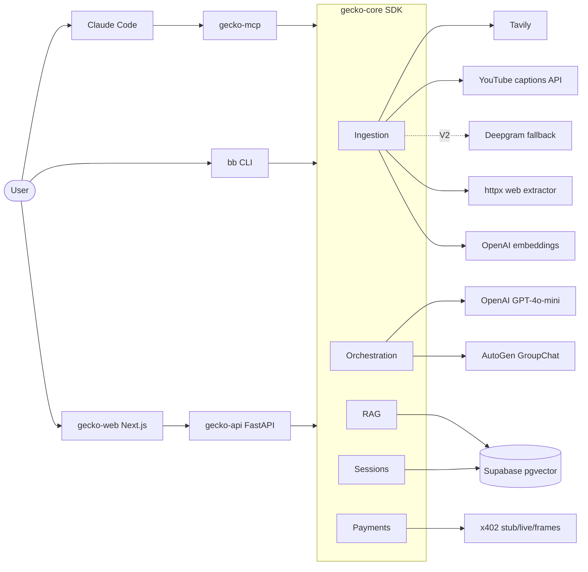
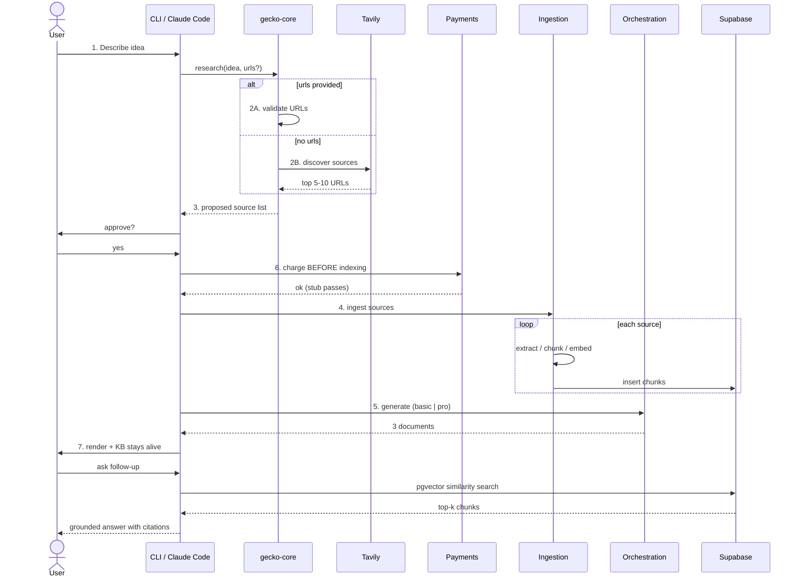

# Implementation Plan

**Date:** 2026-04-25
**Owner:** Ernani Britto
**Target:** V1 demo Monday 2026-04-27, V2 lands within 90 days

---

## Architecture



**Reading the diagram.** Three client surfaces (Claude Code, CLI, Web) reach the SDK through three transports (MCP, direct import, FastAPI). The SDK has five internal modules. External services sit at the leaves. The dashed line for Deepgram means V2 — for V1 we ship without it.

## User flow (the 7 steps)



**Note step 6 ordering.** Payment runs *before* ingestion. This protects you from spending OpenAI/Tavily credits on a session that won't pay. Stub mode short-circuits the call but still executes the gate so the live path stays exercised.

---

## Phases

Estimated times assume migrating existing V1 code. From-scratch times are roughly 2x.

### Phase 1 — Schema + sessions

**Goal:** Supabase ready. Sessions, sources, chunks tables with pgvector.
**Owner:** `data-engineer`
**Time:** 1–2 hours migrating, 3 hours from scratch

**Deliverables**
- `infra/supabase/migrations/20260425000000_init.sql` — extension + tables
- `infra/supabase/migrations/20260425000100_pgvector_index.sql` — IVFFlat or HNSW index on chunks.embedding
- `packages/gecko-core/src/gecko_core/sessions/store.py` — `SessionStore` class with `create`, `update_status`, `get`, `list_sources`

**Schema sketch**

```sql
CREATE EXTENSION IF NOT EXISTS vector;

CREATE TABLE sessions (
  id              UUID PRIMARY KEY DEFAULT gen_random_uuid(),
  idea            TEXT NOT NULL,
  tier            TEXT NOT NULL CHECK (tier IN ('basic', 'pro')),
  status          TEXT NOT NULL DEFAULT 'pending',
  payment_intent_id TEXT UNIQUE,
  payment_mode    TEXT NOT NULL DEFAULT 'stub',
  created_at      TIMESTAMPTZ NOT NULL DEFAULT now(),
  completed_at    TIMESTAMPTZ,
  deleted_at      TIMESTAMPTZ
);

CREATE TABLE sources (
  id              UUID PRIMARY KEY DEFAULT gen_random_uuid(),
  session_id      UUID NOT NULL REFERENCES sessions(id) ON DELETE CASCADE,
  url             TEXT NOT NULL,
  url_hash        TEXT NOT NULL,
  type            TEXT NOT NULL CHECK (type IN ('youtube', 'web')),
  chunk_count     INT NOT NULL DEFAULT 0,
  indexed_at      TIMESTAMPTZ NOT NULL DEFAULT now(),
  UNIQUE (session_id, url_hash)
);

CREATE TABLE chunks (
  id              UUID PRIMARY KEY DEFAULT gen_random_uuid(),
  session_id      UUID NOT NULL REFERENCES sessions(id) ON DELETE CASCADE,
  source_id       UUID NOT NULL REFERENCES sources(id) ON DELETE CASCADE,
  chunk_index     INT NOT NULL,
  text            TEXT NOT NULL,
  embedding       VECTOR(1536) NOT NULL,
  UNIQUE (source_id, chunk_index)
);

CREATE INDEX chunks_session_id_idx ON chunks(session_id);
CREATE INDEX chunks_embedding_idx
  ON chunks USING ivfflat (embedding vector_cosine_ops)
  WITH (lists = 100);
```

**Smoke test**
- Migrations apply clean on a blank Supabase project
- `SessionStore().create(idea="x", tier="basic")` returns a UUID and persists
- Same row retrievable across a process restart

**PRD acceptance criteria covered:** "Session ID, tier, status, timestamps, and linked sources/chunks persist across restarts"

---

### Phase 2 — Ingestion adapters + pipeline

**Goal:** URL → text → chunks → embeddings → Supabase, end to end.
**Owner:** `data-engineer` for chunker/embedder/store, `software-engineer` for adapters and pipeline orchestration
**Time:** 2–3 hours migrating, 6 hours from scratch

**Deliverables**

| File | Purpose |
|---|---|
| `ingestion/discovery.py` | `discover(idea: str) -> list[SourceCandidate]` via Tavily |
| `ingestion/transcript.py` | `TranscriptProvider` protocol + `YouTubeCaptionsProvider` |
| `ingestion/youtube.py` | `extract(url) -> str` using transcript provider chain |
| `ingestion/web.py` | `extract(url) -> str` using httpx + BeautifulSoup |
| `ingestion/chunker.py` | `chunk(text, size=512, overlap=50) -> list[Chunk]` using tiktoken |
| `ingestion/embedder.py` | `embed(chunks) -> list[Embedding]` batching at 100 |
| `ingestion/pipeline.py` | `ingest(session_id, sources) -> IngestionResult` |

**Concurrency rule.** Process up to 5 sources concurrently with `asyncio.Semaphore`. Don't hammer YouTube or any single domain. Embeddings batch up to 100 chunks per OpenAI call regardless of source count.

**Idempotency rule.** `url_hash = sha256(url)`. On re-ingest with same `(session_id, url_hash)`, skip — `ON CONFLICT DO NOTHING`.

**Failure rule.** Per-source, not global. If 3 of 7 sources fail extraction, the other 4 still index. Failed sources are logged with the specific reason (no captions, network timeout, etc.) and surfaced to the user.

**Smoke tests**
- One YouTube URL with captions → chunks land in DB, count > 0
- One YouTube URL without captions → adapter returns None, source skipped, no error
- One web article → chunks land in DB
- Mixed batch (2 YT + 2 web) → all index, run completes < 60s
- Re-ingest same URLs → no duplicate chunks
- Tavily discovery for "hotel guide for Brazil" → returns 5–10 URLs

**PRD acceptance criteria covered:** "All chunks are ≤ 512 tokens", "Uses `text-embedding-3-small`; stores in Supabase pgvector", "Session, sources, and chunks are persisted; duplicate URLs are skipped", "Indexing pipeline (5 sources) completes in < 3 minutes"

---

### Phase 3 — Approval flow

**Goal:** User confirms the proposed source list before the payment gate runs.
**Owner:** `product-designer` for UX, `software-engineer` for plumbing
**Time:** 30 minutes

**Deliverables**
- CLI: `bb research` shows source table with Y/n prompt unless `--yes` is passed
- MCP: `gecko_research` accepts `auto_approve: bool = True` (default true so Claude Code flows naturally; users can override per call)

**Decision: default for the demo.** For Monday, run with `--yes` so the demo is uninterrupted. For real use, default to prompting in CLI.

**Smoke tests**
- `bb research --idea "..." --yes` — no prompt, proceeds
- `bb research --idea "..."` — shows source table, accepts y/Y/yes, rejects on n/N/anything else
- MCP call with `auto_approve=False` — returns proposed sources, second call confirms

---

### Phase 4 — Payment gate

**Goal:** Three-mode x402 client. Gate runs before any indexing. No partial state.
**Owner:** `web3-engineer`
**Time:** 1 hour for stub + skeletons; 4 hours for live wiring (post-demo)

**Deliverables**

```python
# packages/gecko-core/src/gecko_core/payments/x402_client.py

class PaymentIntent(BaseModel):
    intent_id: str        # uuid4 client-side, idempotency key
    session_id: UUID
    tier: Tier
    amount_usd: Decimal

class PaymentResult(BaseModel):
    intent_id: str
    status: Literal["success", "failed"]
    tx_signature: str | None    # Solana tx sig in live/frames mode
    error: str | None

class X402Client(Protocol):
    async def charge(self, intent: PaymentIntent) -> PaymentResult: ...

class StubX402Client:
    async def charge(self, intent): await asyncio.sleep(0.1); return success
class LiveX402Client:    # facilitator URL, Solana wallet
class FramesX402Client:  # frames.ag wallet API (V2)

def get_client(mode: str) -> X402Client: ...
```

**Gate sequence (in `workflows.research`)**
1. Create session row (status=`pending`)
2. Generate `intent_id = uuid4()`, write to `sessions.payment_intent_id`
3. Call `client.charge(intent)`
4. On success: set status=`indexing`, proceed
5. On failure: set status=`failed`, raise `PaymentRequiredError`. NO ingestion runs.

**Smoke tests**
- Stub mode: gate passes, indexing starts within 200ms
- Stub mode: same `intent_id` twice → second call no-op (idempotent)
- Live mode (manual, devnet): real charge succeeds, status updates
- Failure mode (force stub to return failed): no chunks created, session status `failed`

**PRD acceptance criteria covered:** "No indexing runs without a completed payment; `stub` mode passes gate for dev/testing"

---

### Phase 5 — Basic orchestration

**Goal:** Single GPT-4o-mini call produces three documents with citations.
**Owner:** `software-engineer`
**Time:** 1–2 hours migrating, 4 hours from scratch

**Deliverables**
- `orchestration/basic.py` — single function `generate(session_id, idea) -> ResearchResult`
- Prompt template that includes:
  - The idea
  - Top-N indexed chunks with their source URLs (RAG context)
  - Schema for output (matches `ResearchResult` Pydantic model)
- `response_format={"type": "json_object"}` — non-negotiable
- Pydantic validation on output. Retry once on validation failure with the validation error in the retry prompt.

**Citation requirement.** Every claim in business_plan/validation_report/prd must reference a `source_url` from the indexed corpus. Validate this in the Pydantic model: `citations: list[Citation] = Field(min_length=1)` per document.

**Smoke tests**
- Given a session with 5 indexed sources, `basic.generate` returns valid `ResearchResult`
- All citations point to URLs that exist in `sources` for that session
- Total latency < 60s
- Re-run with bad LLM output (mock): retry loop kicks in, eventual success or typed failure

**PRD acceptance criteria covered:** "Single LLM pass returns documents in < 60 seconds", "Returns valid JSON with `business_plan`, `validation_report`, `prd` keys"

---

### Phase 6 — Pro orchestration (AutoGen GroupChat)

**Goal:** 5-agent GroupChat (4 specialists + orchestrator) produces the same `ResearchResult` shape as basic, but deeper.
**Owner:** `software-engineer`
**Time:** 2–3 hours migrating, 8 hours from scratch

**Agents** (per PRD)

| Agent | Role |
|---|---|
| Orchestrator | Plans the conversation, decides when each specialist speaks, calls the merge step |
| Research | Pulls relevant chunks via `rag_query` tool, summarizes evidence |
| Market Analyst | Sizes the market, identifies competitors, quantifies demand |
| Technical Architect | Drafts the V1/V2/V3 PRD scope and acceptance criteria |
| Validator | Stress-tests claims, flags risks, demands citations |

**RAG tool exposed to all specialists**

```python
async def rag_query(question: str, top_k: int = 5) -> list[Chunk]:
    """Call from inside the GroupChat to ground responses in the session's KB."""
```

**Persistence rule.** Agent state (conversation history, scratch notes) lives 72h post-session in Supabase. After 72h it's purged. Don't try to hold it in memory across requests.

**Smoke tests**
- GroupChat completes within 5 minutes for a 5-source session
- Each specialist contributes at least once (count messages by role)
- Final output validates as `ResearchResult`
- Every claim has a citation
- After 72h, agent context is purged (cron job + smoke test for the cron)

**PRD acceptance criteria covered:** "AutoGen GroupChat completes in < 5 minutes", "agents stay alive 72h post-session", "Agents can pull context from the session knowledge base via pgvector similarity search"

---

### Phase 7 — Output rendering + the reveal moment

**Goal:** The CLI document reveal feels earned, not robotic.
**Owner:** `product-designer`
**Time:** 1 hour (renderer is already stubbed in `apps/cli/src/gecko_cli/render.py`)

**Deliverables**
- Three Rich `Panel`s in order: Business Plan → Validation Report → PRD
- `Rule` separator between each
- Citations as numbered list at bottom of each panel
- Progress: `rich.progress` with phases "Discovering", "Indexing N sources", "Generating documents"

**Smoke tests**
- Render at terminal width 80, 120, 200 — no clipping
- Citations clickable in iTerm2 / Wezterm (URLs are real `https://`)
- Long ideas (500 chars) don't break the panel header

---

### Phase 8 — MCP wiring verification

**Goal:** All three tools work from Claude Code.
**Owner:** `software-engineer`
**Time:** 30 minutes (already stubbed in `packages/gecko-mcp/`)

**Smoke tests**
- `gecko-mcp doctor` exits 0 with all env vars set
- `gecko-mcp doctor` exits 1 with a missing env var, names the missing var
- `claude mcp add gecko -- gecko-mcp serve` registers
- From Claude Code: `gecko_research`, `gecko_ask`, `gecko_sources` all callable
- Skill bootstrap from `app.geckovision.tech/skill.md` on a clean machine completes

---

### Phase 9 — API exposure (V2 prep, optional for demo)

**Goal:** FastAPI service callable from `gecko-web`.
**Owner:** `software-engineer`
**Time:** 1 hour (already stubbed in `packages/gecko-api/`)

**Smoke tests**
- `uvicorn gecko_api.main:app` starts
- `GET /healthz` returns 200
- `POST /research` with valid body returns 200 + `ResearchResult` JSON
- `GET /docs` shows OpenAPI Swagger UI
- CORS allows `https://app.geckovision.tech` and `http://localhost:3000`

**Skip for V1 demo.** Only run if you have spare time.

---

## End-to-end smoke test (the demo path)

This is the test that must pass on the demo machine before Monday:

```bash
# from clean clone
uv sync
cp .env.example .env  # fill in keys, X402_MODE=stub

# 1. Doctor
uv run gecko-mcp doctor                    # exits 0

# 2. Research the demo idea
uv run bb research --idea "hotel guide for Brazil" --yes
# expect: ~60s total, three Panels render, session_id printed

# 3. Sources audit
uv run bb sources <session_id>
# expect: table of 5–10 indexed URLs

# 4. Follow-up question
uv run bb ask <session_id> "what's the strongest validation signal for this idea?"
# expect: grounded answer with citations

# 5. Frames-style flow (if Sunday-night-stable)
# in Claude Code:
#   "Read https://app.geckovision.tech/skill.md and follow the instructions"
# then:
#   "Use gecko_research to validate: a hotel guide for Brazil"
```

If steps 1–4 work, you have Flow A. If step 5 also works, you have Flow B. **Demo Flow B if step 5 worked twice in a row Sunday night, else Flow A.**

---

## V2 work tracker

Not in scope for Monday. Listed here so V2 doesn't get lost.

| Item | Phase | Owner |
|---|---|---|
| Deepgram fallback for caption-less YouTube | 2 (extend) | `data-engineer` + `software-engineer` |
| frames.ag wallet integration (`X402_MODE=frames`) | 4 (extend) | `web3-engineer` |
| Creator attribution graph | New | `data-engineer` |
| `gecko-web` Next.js app | New | `frontend-engineer` (in `gecko-web` repo) |
| Privy embedded wallets for non-technical founders | New | `web3-engineer` + `frontend-engineer` |
| Session sharing (read-only KB links) | New | `software-engineer` |

---

## Tracking

Keep a `docs/build-log.md` in this repo. One line per phase as you finish it:

```
2026-04-25 14:00  Phase 1 done — schema applied to dev project, SessionStore green
2026-04-25 16:30  Phase 2 done — ingestion smoke passes for Brazil hotel idea
...
```

This is for you, not for show. It surfaces drift between estimate and actual, which is the only way you learn how long this stuff really takes.
